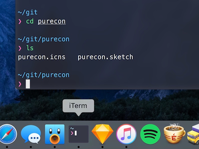

#Purecon
> An icon for iTerm, but can be used with Terminal and Hyper too.

I recently switched from Terminal and bash to iTerm 2 and zsh, and the only thing I didn't like was iTerm2's icon. So I made a new one.

The icon is inspired by Pure prompt and Snazzy color scheme.  
Pure prompt: [github.com/sindresorhus/pure](https://github.com/sindresorhus/pure)  
iterm2-snazzy: [github.com/sindresorhus/iterm2-snazzy](https://github.com/sindresorhus/iterm2-snazzy)

## Install
Click Get Info on *iTerm*. Drag *purecon.icns* file to apps icon (top left) in the Get Info window. Restart the app.

You can watch me do it on YouTube: [youtu.be/pN9FEAkth3s](https://youtu.be/pN9FEAkth3s)

## How
Designed in Sketch. Used Export More plugin for automated ICNS export.  
[github.com/nathco/Export-More](https://github.com/nathco/Export-More)